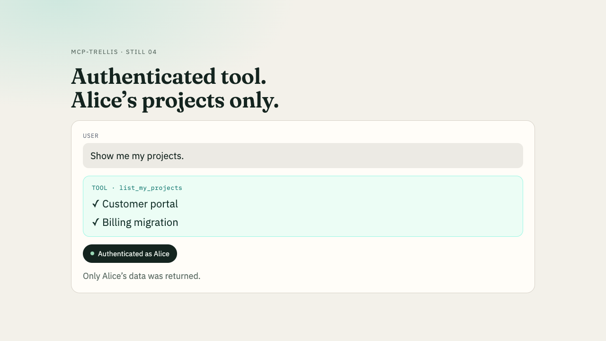

# mcp-trellis

Add authenticated AI connectors to your existing SaaS.
Reuse your users, login and permissions. Trellis handles MCP + OAuth.

```
Existing SaaS
users + login + data
       ↓
  mcp-trellis
       ↓
Claude / ChatGPT / Gemini
```

[](https://www.npmjs.com/package/mcp-trellis)
[](https://github.com/amir1824/mcp-trellis/actions/workflows/ci.yml)
[](LICENSE)

## Demo



```bash
npm install mcp-trellis
```

## The 30-second example

```ts
import { createMcpApp, signedTokenAuth } from "mcp-trellis";
import { session, projectsForUser, codeStore } from "./your-app.js";

export const mcp = createMcpApp<{ userId: string }>({
  serverInfo: { name: "my-saas", version: "1.0.0" },
  auth: signedTokenAuth({
    secret: process.env.MCP_SECRET!,
    resolveUser: (req) => session(req),
    loginUrl: (_r, n) => `/login?next=${encodeURIComponent(n)}`,
    codeStore,
  }),
  context: (_r, p) => ({ userId: p!.id }),
  tools: [{ name: "list_my_projects", description: "List projects",
    inputSchema: { type: "object", properties: {} }, scope: "mcp",
    handler: async ({ userId }) => JSON.stringify(await projectsForUser(userId)) }],
});
```

`codeStore` must be a shared single-use store (Redis/KV — see [examples/stores.ts](examples/stores.ts)). Advanced ports (`mintAccessToken`, `verifyToken`, refresh, revoke) remain available when you outgrow the helper. Node ≥20.

**[View the complete SaaS demo](examples/saas-demo/README.md)** — working login, consent, two users with different projects.

Also listed on the Official MCP Registry as **Project desk** (reference remote server; not the SDK) — see [`examples/project-desk`](examples/project-desk/).

## When should I use this?

- Your TypeScript app already has login and user data, and you want to expose user-scoped tools through remote MCP.
- You want the MCP handler and OAuth authorization endpoints in one package, with zero runtime dependencies.
- You want to reuse your runtime and existing storage. The library does not require a new database; production deployments still need appropriate replay, token and session storage.

## When should I not use this?

- You need a managed identity provider, a user database, or a login system built for you.
- You already have an MCP server and authorization server that meet your needs.
- You need protocol features or client combinations absent from the [verified support table](docs/compatibility.md).
- You only need a local stdio tool with no remote authorization flow.

## Run a real tool

The [Project desk demo](examples/saas-demo/README.md) is the canonical example ([`examples/project-desk`](examples/project-desk/) implementation): app login → OAuth consent → access token → `list_my_projects`. Alice sees her two projects; Bob sees his own. It uses fictional data and an independent app session.

**Live Claude / ChatGPT recordings are still pending.** Automated OAuth tests are not evidence that a current vendor client has connected successfully.

## Clients and compatibility

| Profile | Implemented server flow | Live client evidence |
|---|---|---|
| Claude (`claude`) | Dynamic registration, public client, PKCE | Pending |
| ChatGPT / Codex (`codex`) | Public client, PKCE; configure exact hosted callback as needed | Pending for each product |
| Gemini Enterprise (`gemini`) | Pre-registered client; secret basic/post; requires `clientStore` | Pending; does not imply every Gemini product |

Protocol versions implemented: `2024-11-05`, `2025-03-26`, `2025-06-18`; default `2025-06-18`. See [test evidence and verification checklist](docs/compatibility.md), [client configuration](docs/guide.md#clients) and [troubleshooting](docs/troubleshooting.md).

## Integrate with your app

Prefer `signedTokenAuth` for a one-secret start. For refresh, revoke, or your own JWT/JWKS, implement `resolveUser`, `loginUrl`, `mintAccessToken` and `verifyToken` yourself. Mint tokens for the requested MCP resource and return their verified `audience`; the library rejects an audience mismatch before executing tools. A logged-in user still sees an OAuth consent screen. Your data layer must enforce ownership and tenant permissions. Browser callers that send an `Origin` header need `allowedRequestOrigins` (fail-closed by default) — see [security.md](docs/security.md).

[SaaS demo](examples/saas-demo/README.md) · [Next.js starter](examples/nextjs-saas/README.md) · [Host recipes](docs/guide.md) · [Security](docs/security.md) · [npm](https://www.npmjs.com/package/mcp-trellis)

## How it compares

mcp-trellis is the **vendor-neutral embedded BYO-auth** path: MCP handler and self-hosted OAuth AS in one npm install. Contrast composition stacks such as **xmcp + Scalekit** (or WorkOS / Descope connectors) that split the MCP runtime and the identity product across 2–3 packages. Full comparison table: [docs/ROADMAP.md](docs/ROADMAP.md).

## Architecture

`createMcpApp` wires MCP and OAuth and routes between them:


Host recipes, ports, tools, and multi-tenant: [docs/guide.md](docs/guide.md).

## Docs

| Doc | Contents |
|-----|----------|
| [docs/guide.md](docs/guide.md) | Architecture, clients, recipes, ports, tools, multi-tenant |
| [docs/reference.md](docs/reference.md) | Routes, methods, status codes, options, exports |
| [docs/security.md](docs/security.md) | Protocol promises, threat model, not in scope |
| [docs/ROADMAP.md](docs/ROADMAP.md) | What's next |

Canonical example: [`examples/project-desk`](examples/project-desk/) ([local docs](examples/saas-demo/)). Recipes: [`examples/`](examples/).

## Contributing

PRs welcome — see [CONTRIBUTING.md](CONTRIBUTING.md).

```bash
npm test
npm run build
npm run typecheck
```

## License

MIT
