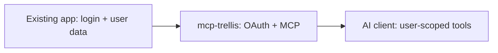

# mcp-trellis

**Build a secure remote MCP server using the auth your app already has.**

Claude, ChatGPT and Gemini. No new database. No auth vendor. One TypeScript package.

Your app already knows who the user is. Connecting an AI client still means wiring OAuth discovery, registration, consent, PKCE and token exchange. **mcp-trellis handles that protocol work**, while your app keeps login, token verification and data permissions.



## The 30-second example

```bash
npm install mcp-trellis
```

```ts
import { createMcpApp } from "mcp-trellis";
import { existingAuth, projectsForUser } from "./your-app.js";

export const mcp = createMcpApp<{ userId: string }>({
  serverInfo: { name: "my-saas", version: "1.0.0" },
  clients: ["claude"],
  auth: existingAuth,
  context: (_request, user) => ({ userId: user!.id }),
  tools: [{
    name: "list_my_projects",
    description: "List the signed-in user's projects",
    inputSchema: { type: "object", properties: {} },
    scope: "mcp",
    handler: async ({ userId }) => JSON.stringify(await projectsForUser(userId)),
  }],
});
```

This shows the integration shape: `your-app.js` is your application's auth/data adapter, not a supplied module. **[Run the complete Node demo](examples/saas-demo/README.md)** for working login, token handling and two users with different projects. Node ≥20 is required.

[](https://www.npmjs.com/package/mcp-trellis)
[](https://github.com/amir1824/mcp-trellis/actions/workflows/ci.yml)
[](LICENSE)

## When should I use this?

- Your TypeScript app already has login and user data, and you want to expose user-scoped tools through remote MCP.
- You want the MCP handler and OAuth authorization endpoints in one package, with zero runtime dependencies.
- You want to reuse your runtime and existing storage. The library does not require a new database; production deployments still need appropriate replay, token and session storage.

## When should I not use this?

- You need a managed identity provider, a user database, or a login system built for you.
- You already have an MCP server and authorization server that meet your needs.
- You need protocol features or client combinations absent from the [verified support table](docs/compatibility.md).
- You only need a local stdio tool with no remote authorization flow.

## Run a real tool

The [Project desk demo](examples/saas-demo/README.md) proves the local flow: app login → OAuth consent → access token → `list_my_projects`. Alice sees her two projects; Bob sees his own. It uses fictional data and an independent app session.

**Live Claude / ChatGPT recordings are still pending.** Automated OAuth tests are not evidence that a current vendor client has connected successfully.

## Clients and compatibility

| Profile | Implemented server flow | Live client evidence |
|---|---|---|
| Claude (`claude`) | Dynamic registration, public client, PKCE | Pending |
| ChatGPT / Codex (`codex`) | Public client, PKCE; configure exact hosted callback as needed | Pending for each product |
| Gemini Enterprise (`gemini`) | Pre-registered client; secret basic/post; requires `clientStore` | Pending; does not imply every Gemini product |

Protocol versions implemented: `2024-11-05`, `2025-03-26`, `2025-06-18`; default `2025-06-18`. See [test evidence and verification checklist](docs/compatibility.md), [client configuration](docs/guide.md#clients) and [troubleshooting](docs/troubleshooting.md).

## Integrate with your app

Implement `resolveUser`, `loginUrl`, `mintAccessToken` and `verifyToken` using your app's existing auth. Mint tokens for the requested MCP resource and return their verified `audience`; the library rejects an audience mismatch before executing tools. A logged-in user still sees an OAuth consent screen. Your data layer must enforce ownership and tenant permissions. Browser callers that send an `Origin` header need `allowedRequestOrigins` (fail-closed by default) — see [security.md](docs/security.md).

[Node demo](examples/saas-demo/README.md) · [Host recipes](docs/guide.md) · [Security responsibilities](docs/security.md) · [npm](https://www.npmjs.com/package/mcp-trellis)

## Architecture

`createMcpApp` wires MCP and OAuth and routes between them:


Host recipes, ports, tools, and multi-tenant: [docs/guide.md](docs/guide.md).

## Docs

| Doc | Contents |
|-----|----------|
| [docs/guide.md](docs/guide.md) | Architecture, clients, recipes, ports, tools, multi-tenant |
| [docs/reference.md](docs/reference.md) | Routes, methods, status codes, options, exports |
| [docs/security.md](docs/security.md) | Protocol promises, threat model, not in scope |
| [docs/ROADMAP.md](docs/ROADMAP.md) | What's next |

Examples: [`examples/`](examples/) — HTTP server, Worker, multi-tenant, stores, audit.

## Contributing

PRs welcome — see [CONTRIBUTING.md](CONTRIBUTING.md).

```bash
npm test
npm run build
npm run typecheck
```

## License

MIT
