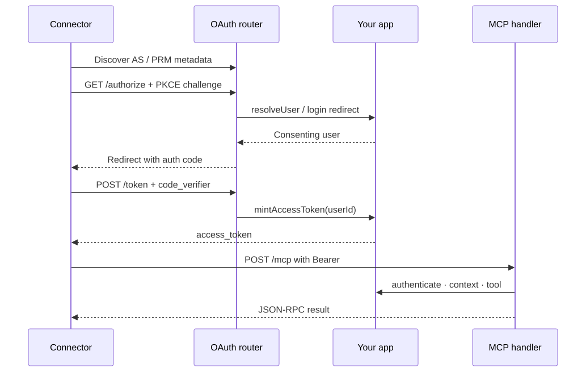

# mcp-trellis

[](https://github.com/amir1824/mcp-trellis/actions/workflows/ci.yml)
[](LICENSE)

**Host-agnostic MCP + OAuth ports** — you bring the runtime and IdP; the library owns the connector protocol.

Web-standard `Request` → `Response`. Same handler on Cloudflare Workers, Next.js App Router, Deno, Bun, and Node HTTP via `mcp-trellis/node`. Zero runtime dependencies.

## Why mcp-trellis

Pick this when you want **the whole connector stack in one package** — the MCP
handler *and* a real OAuth 2.1 authorization server — with no database to run
and no vendor to sign up with:

| | mcp-trellis | Official MCP SDK | `workers-oauth-provider` | `@mcpauth/auth` | Auth0 / Clerk / Authlete |
|---|---|---|---|---|---|
| MCP handler | ✅ | ✅ | ❌ | ❌ | ❌ |
| OAuth 2.1 authorization server | ✅ | ❌ bring your own | ✅ | ✅ | ✅ |
| Runtime | any Web-standard | any Web-standard | Workers only | Node | — |
| Database | none | — | KV (optional) | **required** — Prisma/Drizzle, with migrations | — |
| Runtime dependencies | **zero** | several | several | several | — |
| Self-hosted | ✅ | ✅ | ✅ | ✅ | ❌ SaaS |
| Named connector profiles (Claude / Gemini / Codex), enforced not just advertised | ✅ | ❌ | ❌ | ❌ | ❌ |

Prefer the official SDK when you already have (or want) a separate
authorization server — it doesn't ship one. Prefer `workers-oauth-provider`
when you're committed to Workers and want Cloudflare's own implementation.
Prefer a managed IdP (Auth0, Clerk, Authlete, WorkOS) when you'd rather pay
than operate one. Prefer mcp-trellis when you want the protocol layer and the
AS in one package, with **nothing to provision** — you still own login, token
minting, and storage; the library owns the protocol.

## Requirements

- **Node ≥ 20** for Node hosts (global WebCrypto in ESM)
- Or any runtime with WebCrypto + `fetch` (Workers, Deno, Bun)

## Install

```bash
npm install mcp-trellis
```

## 60-second server

One call mounts the MCP endpoint, the OAuth authorization server, and both
discovery documents — and routes between them:

```ts
import { createMcpApp } from "mcp-trellis";

const app = createMcpApp({
  serverInfo: { name: "demo", version: "1.0.0" },
  clients: ["claude"],
  tools: [
    {
      name: "echo",
      description: "Echo text back",
      inputSchema: {
        type: "object",
        properties: { text: { type: "string" } },
        required: ["text"],
      },
      scope: "mcp",
      handler: (_ctx, args) => String(args.text ?? ""),
    },
  ],
  auth: {
    codeSecret: process.env.OAUTH_CODE_SECRET!,
    resolveUser: async (req) => getSession(req),
    loginUrl: (_req, next) => `/login?next=${encodeURIComponent(next)}`,
    mintAccessToken: async ({ userId, scope, resource }) => ({
      // Embed `resource` as the token audience (RFC 8707).
      accessToken: await issueUserToken(userId, { aud: resource, scope }),
      expiresIn: 3600,
    }),
    verifyToken: async (token) => {
      const claims = await readUserToken(token);
      if (!claims) return null;
      return {
        userId: claims.sub,
        scopes: claims.scope.split(" "),
        audience: claims.aud,
      };
    },
  },
});

export default { fetch: (req: Request) => app.fetch(req) };
```

You return the token's `audience`; **the library rejects tokens minted for a
different resource** before any tool runs. That check is the one preventing
confused-deputy attacks, so it is not yours to remember.

Smoke-test with `initialize` (public — no Bearer needed):

```bash
curl -s http://127.0.0.1:8787/mcp \
  -H 'content-type: application/json' \
  -d '{"jsonrpc":"2.0","id":1,"method":"initialize","params":{"protocolVersion":"2025-06-18"}}'
```

## Client compatibility

Name the connector clients you serve; the AS is configured to match.

| Client | Registration | Token endpoint auth | Notes |
|--------|--------------|---------------------|-------|
| `claude` | Dynamic (DCR), public + PKCE | `none` | Claude Custom Connectors callback is allowlisted for you |
| `gemini` | **Pre-registered**, confidential | `client_secret_basic`, `client_secret_post` | Gemini Enterprise is registered with your org's IdP — supply `auth.clientStore` |
| `codex` | OAuth 2.1 per MCP auth spec, public + PKCE | `none` | ChatGPT / Codex share one connector contract |

```ts
createMcpApp({
  clients: ["claude", "gemini"],
  auth: {
    // …
    clientStore: {
      get: async (clientId) => lookupClient(clientId),
      verifySecret: async (clientId, presented) =>
        checkSecret(clientId, presented),
    },
  },
});
```

Naming a pre-registered client without a `clientStore` throws at construction
rather than failing at the first token exchange. Secret storage and comparison
stay in your `clientStore` — the library never sees or persists credentials.

Naming only pre-registered clients (`clients: ["gemini"]`, no `claude` /
`codex`) sets `allowUnregisteredClients: false`: `/register` is unmounted
and dropped from AS metadata, unknown ids are rejected with
`unauthorized_client` at `authorize` and `invalid_client` at `token` and
`revoke`. Naming `claude` or `codex` alongside `gemini` reopens dynamic
registration.

## How it fits together

What `createMcpApp` wires for you — two pieces, one deciding which requests go
to the other:



Typical first-connection path:



You only touch this routing directly if you skip `createMcpApp` — see
[Advanced: compose the primitives](#advanced-compose-the-primitives).

## Package surface

| Import | What you get |
|--------|----------------|
| `mcp-trellis` | `createMcpApp`, client profiles, MCP handler, tool registry, bearer helpers, HTTP utils |
| `mcp-trellis/oauth` | OAuth 2.1 AS router, PKCE, auth codes, client auth, metadata |
| `mcp-trellis/node` | `asNodeHandler` + `resolveOrigin` for Node `(req, res)` |

`createMcpApp` is the batteries-included layer. `createMcpHandler` and
`createOAuthRouter` remain exported and unchanged — reach for them when you want
to own the routing or mount the two halves separately.

### Default OAuth routes

With defaults `resourcePath: "/mcp"` and `oauthPath: "/mcp/oauth"`:

| Path | Purpose |
|------|---------|
| `/.well-known/oauth-protected-resource` (+ `/mcp`) | Protected resource metadata |
| `/.well-known/oauth-authorization-server` (+ `/mcp`) | Authorization server metadata |
| `/mcp/oauth/register` | Dynamic client registration (unmounted when DCR is off) |
| `/mcp/oauth/authorize` | Authorization endpoint |
| `/mcp/oauth/token` | Token endpoint |
| `/mcp/oauth/revoke` | Token revocation (RFC 7009; mounted only when `revokeToken` is set) |

## Recipes

### Cloudflare Worker, Next.js, Deno, Bun

`createMcpApp` returns a plain `fetch`, so the same object mounts everywhere:

```ts
// Worker
export default { fetch: (req: Request, env: Env) => buildApp(env).fetch(req) };

// Next.js App Router — app/[[...mcp]]/route.ts
export const GET = (req: Request) => app.fetch(req);
export const POST = (req: Request) => app.fetch(req);
export const OPTIONS = (req: Request) => app.fetch(req);

// Node / Express / Cloud Run
import { asNodeHandler } from "mcp-trellis/node";
export const mcp = asNodeHandler(app, { origin: process.env.MCP_PUBLIC_ORIGIN! });
```

The Node bridge reads the request stream when `req.body` is absent, so raw
`http.createServer` works without a body-parser. Runnable recipe:
[`examples/http-server.ts`](examples/http-server.ts).

## Advanced: compose the primitives

Skip `createMcpApp` when you want to own the routing. Same behavior, more wiring:

```ts
import { createMcpHandler, createToolRegistry, parseBearer } from "mcp-trellis";
import { createOAuthRouter } from "mcp-trellis/oauth";

type Ctx = { userId: string };
type Env = { OAUTH_CODE_SECRET: string };

const registry = createToolRegistry<Ctx>([
  {
    name: "ping_db",
    description: "Health check",
    inputSchema: { type: "object", properties: {} },
    scope: "read",
    handler: async () => "ok",
  },
]);

const handler = createMcpHandler<Ctx>({
  registry,
  serverInfo: { name: "my-app", version: "1.0.0" },
  instructions: "Tools available to authenticated clients.",
  wwwAuthenticate: (req) => ({
    realm: "my-app",
    resourceMetadataUrl: `${new URL(req.url).origin}/.well-known/oauth-protected-resource/mcp`,
  }),
  ports: {
    authenticate: async (req) => {
      const token = parseBearer(req.headers.get("authorization"));
      if (!token) return null;
      // Reject tokens whose aud ≠ this server's canonical resource.
      return { id: "user-1", scopes: ["read"] };
    },
    context: async (_req, principal) => ({
      userId: principal?.id ?? "",
    }),
  },
});

export default {
  async fetch(request: Request, env: Env): Promise<Response> {
    const oauth = createOAuthRouter({
      ports: {
        codeSecret: env.OAUTH_CODE_SECRET,
        resolveUser: async () => ({ id: "user-1" }),
        loginUrl: (req, next) =>
          `${new URL(req.url).origin}/login?next=${encodeURIComponent(next)}`,
        mintAccessToken: async ({ userId, resource }) => ({
          // Embed `resource` as the token audience (RFC 8707).
          accessToken: await issueUserToken(userId, { aud: resource }),
          expiresIn: 3600,
          scope: "mcp",
        }),
      },
    });

    const oauthResponse = await oauth.tryHandle(request);
    if (oauthResponse) return oauthResponse;
    if (new URL(request.url).pathname === "/mcp") return handler.fetch(request);
    return new Response("Not found", { status: 404 });
  },
};
```

### Next.js App Router

Delegate Web `Request` straight through — same handler as above:

```ts
// app/mcp/route.ts
import { handler, oauth } from "@/lib/mcp"; // your shared setup

export async function GET(req: Request) {
  const oauthResponse = await oauth.tryHandle(req);
  if (oauthResponse) return oauthResponse;
  return handler.fetch(req);
}

export async function POST(req: Request) {
  const oauthResponse = await oauth.tryHandle(req);
  if (oauthResponse) return oauthResponse;
  return handler.fetch(req);
}

export async function OPTIONS() {
  return handler.fetch(new Request("https://local/mcp", { method: "OPTIONS" }));
}
```

Also mount `.well-known/*` and `/mcp/oauth/*` the same way (or route everything through one catch-all that calls `oauth.tryHandle` first).

### Node HTTP `(req, res)`

Express, Cloud Functions, Cloud Run, `http.createServer` — bridge with
`asNodeHandler`. Runnable recipe: [`examples/http-server.ts`](examples/http-server.ts)
(`npx tsx examples/http-server.ts`).

## Ports — what you implement

The library stays protocol-shaped. Your app plugs in the seams:



### App (`createMcpApp`)

| Port | Role |
|------|------|
| `verifyToken(token, req)` | Decode a bearer and return `{ userId, scopes, audience }`, or `null`. **The library compares `audience` against this server's canonical resource** — you cannot forget the check |
| `resolveUser`, `loginUrl`, `mintAccessToken`, `codeSecret` | Same as the OAuth ports below |
| `clientStore?` | Pre-registered clients; required for confidential clients like Gemini |
| `refreshAccessToken?` | If set, metadata advertises `refresh_token` |
| `revokeToken?` | RFC 7009; presence mounts `/revoke` and advertises `revocation_endpoint` |
| `context?`, `audit?` | Same as the MCP ports below; `context` defaults to an empty object |

### MCP (`createMcpHandler`)

The lower-level handler. Here the audience check is **yours** — prefer
`createMcpApp` unless you need the control.

| Port | Role |
|------|------|
| `authenticate(req, method, tool?)` | Return `{ id, scopes }`, or `null` → 401 + `WWW-Authenticate`. **Must reject tokens whose audience is not this server’s canonical resource** (see Threat model) |
| `context(req, principal)` | Build per-request ctx for tools (DB, env, …) |
| `audit?(entry)` | Optional telemetry: tool results **and** every denial (bad token, missing scope, query-string token). `entry.method` is `""` for transport-level denials made before parsing. Throwing from this port never fails the request |

`wwwAuthenticate` can be a static object or `(req) => …` when the PRM URL depends on origin.

By default `initialize`, `ping`, and notifications are public. Override `publicMethods` if every method must require Bearer.

### OAuth (`createOAuthRouter`)

| Port | Role |
|------|------|
| `codeSecret` | HMAC secret for signed auth codes (string or `(req) => string`) |
| `resolveUser` | Consenting user, or `null` → redirect to `loginUrl` |
| `loginUrl` | Where unauthenticated authorize requests go |
| `mintAccessToken` | Issue a **user-bound**, **audience-bound** access token (`resource` is the RFC 8707 URI) — never a shared god token |
| `refreshAccessToken?` | If set, metadata advertises `refresh_token`; also receives `resource` |
| `revokeToken?` | If set, mounts `/revoke` and advertises `revocation_endpoint`. Well-formed authenticated revoke → 200 even if the token is unknown; `invalid_request` 400 and `invalid_client` 401 still apply |
| `codeStore?` | Shared single-use jti store for multi-instance (`consume(jti, expMs)`); pruning in-memory default otherwise |
| `clientStore?` | Pre-registered clients: `get(clientId)` returns registered redirect URIs and auth method; `verifySecret(clientId, presented)` authenticates confidential clients. Credentials never enter the library |

Auth codes carry `userId`, `resource`, and the granted `scope`. Clients **must** send `resource` on authorize and token (MCP MUST) — omitting it is a **breaking** requirement vs earlier 0.1.x drafts that ignored the parameter. Advertised grants come only from the handlers you configure. AS metadata sets `resource_parameter_supported: true`.

**Scope is negotiated:** `authorize` validates the requested `scope` against `scopes` (default `["mcp"]`) and rejects anything outside it with `invalid_scope`; an omitted `scope` grants the full advertised set. The auth code carries the grant, and `mintAccessToken` receives it — so `ToolDef.scope` and `principal.scopes` sit on a chain that actually reaches the OAuth layer.

**Client authentication:** unknown `client_id`s are public (PKCE only) unless `allowUnregisteredClients` is `false` — then DCR is unmounted, dropped from metadata, and unrecognized ids are rejected (`unauthorized_client` at authorize, `invalid_client` at token and revoke). `createMcpApp` derives the flag from `clients` via `hasDynamicClient`.

## Tool registry

Schema and handler live in one place — no parallel “defs” and “handlers” lists to keep in sync:

```ts
createToolRegistry(tools, { validateArgs: false }) // default: off, easy adoption
// onToolError?: (exc) => string — default redacts to "Tool execution failed"
```

- Handler may return a `string` or `{ content, isError? }`
- Unknown tools and thrown errors become `isError: true` (not transport errors)
- Thrown exceptions are **redacted** by default (`"Tool execution failed"`); pass `onToolError` to map them. An `onToolError` that itself throws or returns a non-string falls back to the redacted default
- Duplicate tool names throw at registry construction
- Turn `validateArgs: true` once clients send schema-valid args

### Wrapping an API as a tool

`ToolDef` stays the primitive. `defineTool` and `apiTool` are optional sugar for
the common case — turning "I have an API" into "I have an MCP tool" without
hand-rolling arg validation or fetch/error plumbing each time:

```ts
import { apiTool } from "mcp-trellis";

const getWeather = apiTool({
  name: "get_weather",
  description: "Current weather for a city",
  inputSchema: {
    type: "object",
    properties: { city: { type: "string" } },
    required: ["city"],
  },
  // any Standard Schema v1 validator (https://standardschema.dev)
  input: citySchema,
  request: (_ctx, { city }) =>
    `https://api.example.com/weather?city=${encodeURIComponent(city)}`,
  respond: async (res) => {
    const data = await res.json();
    return `${data.tempC}°C, ${data.condition}`;
  },
});
```

- **`inputSchema` stays required** — it's what `tools/list` actually advertises to
  clients, and there's no library-agnostic way to derive JSON Schema from an
  arbitrary Standard Schema validator. Keep the two in sync.
- **`input`** (optional) parses and types `args` before your handler runs — any
  [Standard Schema](https://standardschema.dev)-compliant validator works,
  nothing library-specific. A validation failure returns `isError: true` with
  the issues and never calls your handler.
- **`apiTool`** builds on `defineTool`: give it `request` (build the outgoing
  call from typed args) and optionally `respond` (shape a 2xx response;
  default is the body as text). Non-2xx becomes `isError: true` automatically.
  `fetch` is overridable — testing, request signing, a custom agent.
- `defineTool` alone (without `request`/`respond`) is just the typed-args
  layer over a regular `ToolDef` — use it for anything, not only REST calls.

## Reference

### Supported MCP methods

| Method | Auth | Notes |
|--------|------|-------|
| `initialize` | public | Negotiates protocol version; returns `capabilities.tools` |
| `ping` | public | Empty result |
| `tools/list` | Bearer | Lists registry entries |
| `tools/call` | Bearer + scope | Runs the tool; missing scope → 401 |
| `notifications/*` | public | HTTP 202 empty body |

Anything else → JSON-RPC `-32601`. Capabilities advertise **tools only**.

### HTTP and JSON-RPC status codes

| HTTP | When |
|------|------|
| **202** | Notification (empty body) |
| **400** | Parse error, batch array, invalid request |
| **401** | Missing/invalid Bearer; includes `WWW-Authenticate` |
| **405** | Wrong HTTP verb on MCP |

| JSON-RPC code | Constant |
|---------------|----------|
| `-32700` | `JSONRPC_PARSE_ERROR` |
| `-32600` | `JSONRPC_INVALID_REQUEST` (batches) |
| `-32601` | `JSONRPC_METHOD_NOT_FOUND` |
| `-32602` | `JSONRPC_INVALID_PARAMS` |
| `-32603` | `JSONRPC_INTERNAL_ERROR` |
| `-32001` | `JSONRPC_UNAUTHORIZED` |

### `createMcpHandler` options

| Option | Required | Description |
|--------|----------|-------------|
| `registry` | yes | From `createToolRegistry` |
| `ports` | yes | `authenticate`, `context`, optional `audit` |
| `serverInfo` | yes | `{ name, version }` |
| `wwwAuthenticate` | yes | Static or `(req) => …` for RFC 9728 PRM URL |
| `instructions` | no | Returned on `initialize` |
| `publicMethods` | no | Default: `initialize`, `ping`, notifications |

### `createOAuthRouter` options

| Option | Default | Description |
|--------|---------|-------------|
| `ports` | — | Required OAuth ports (see above) |
| `resourcePath` | `"/mcp"` | MCP resource path in PRM |
| `oauthPath` | `"/mcp/oauth"` | Prefix for authorize / token / register / revoke |
| `realm` | — | Optional realm string |
| `scopes` | `["mcp"]` | Advertised in metadata, and the ceiling `authorize` validates against |
| `tokenEndpointAuthMethods` | `["none"]` | Advertised client auth methods |
| `allowUnregisteredClients` | `true` | `false` requires `clientStore`, unmounts DCR, and rejects unknown `client_id`s (`unauthorized_client` / `invalid_client`) |
| `redirect` | see below | Redirect URI allowlist |

**`redirect` (`RedirectAllowlistOptions`):**

| Field | Default | Description |
|-------|---------|-------------|
| `extra` | `[]` | Exact-match redirect URIs |
| `allowLoopback` | `true` | Allow `http(s)` loopback — `127.0.0.1`, `[::1]`, `localhost` |
| `allowClaude` | `true` | Allow the Claude.ai Custom Connector callback |

Pre-registered clients bypass this allowlist entirely — they are validated
against their own `redirectUris` from `clientStore`.

### `createMcpApp` options

| Option | Default | Description |
|--------|---------|-------------|
| `serverInfo`, `tools`, `auth` | — | Required |
| `clients` | `["claude"]` | Connector profiles to serve |
| `resourcePath` | `"/mcp"` | MCP endpoint path |
| `oauthPath` | `` `${resourcePath}/oauth` `` | OAuth prefix |
| `scopes` | `["mcp"]` | Scopes this server grants |
| `realm` | `serverInfo.name` | `WWW-Authenticate` realm |
| `extraRedirectUris` | `[]` | Callbacks beyond the client profiles |
| `allowLoopback` | `true` | Allow loopback redirects |
| `instructions`, `validateArgs`, `onToolError`, `context`, `audit` | — | Passed through |

### Exports

<details>
<summary><code>mcp-trellis</code></summary>

- `createMcpApp`, `createMcpHandler`, `createToolRegistry`
- `defineTool`, `apiTool` — typed, validated tool authoring on top of `ToolDef`
- `CLIENT_PROFILES`, `DEFAULT_CLIENTS`, `authMethodsFor`, `redirectUrisFor`, `preRegisteredClients`, `hasDynamicClient`
- `parseBearer`, `timingSafeEqual`, `matchesAny`, `wwwAuthenticateHeader`, `rejectQueryToken`
- `validateAgainstSchema`, `JSON_SCHEMA_TYPES`
- `rpcResult`, `rpcError`, JSON-RPC error constants
- `pickProtocolVersion`, `PROTOCOL_VERSIONS`, `DEFAULT_PROTOCOL_VERSION`
- `jsonResponse`, `emptyResponse`, `optionsResponse`, `corsHeaders`, `methodNotAllowed`
- Types: `McpApp`, `McpAppOptions`, `McpAppAuth`, `VerifiedToken`, `ClientName`, `ClientProfile`, `McpHandler`, `McpHandlerOptions`, `McpPorts`, `Principal`, `AuditEntry`, `ServerInfo`, `ToolDef`, `ToolHandler`, `ToolResult`, `ToolRegistry`, `JsonSchema`, `StandardSchemaV1`, `DefineToolOptions`, `ApiToolOptions`, `ApiRequest`, …

</details>

<details>
<summary><code>mcp-trellis/oauth</code></summary>

- `createOAuthRouter`
- `authorizationServerMetadata`, `protectedResourceMetadata`, `mcpWwwAuthenticate`
- `canonicalResource`, `resourcesEqual`, `firstResourceError`, `DEFAULT_RESOURCE_PATH`
- `isAllowedRedirectUri`, `CLAUDE_CALLBACK`
- `issueAuthCode`, `consumeAuthCode`, `newClientId`
- `verifyPkceS256`, `sha256Base64Url`, `randomBase64Url`
- `readClientAuth`, `firstClientAuthError`, `unregisteredClientsAllowed`
- `parseScope`, `formatScope`, `requestedScopes`, `firstScopeError`
- `GRANT_TYPES`, `OAUTH_ERRORS`, `DEFAULT_SCOPE`, `TOKEN_ENDPOINT_AUTH_METHODS`
- Types: `OAuthUser`, `MintedToken`, `OAuthPorts`, `OAuthRouterOptions`, `AuthCodeRecord`, `CodeStore`, `ClientStore`, `RegisteredClient`, `ClientAuth`, `TokenEndpointAuthMethod`, `MintAccessTokenInput`, `RefreshAccessTokenInput`, `RevokeTokenInput`

</details>

<details>
<summary><code>mcp-trellis/node</code></summary>

- `asNodeHandler`, `resolveOrigin`, `toWebRequest`, `sendWebResponse`, `readNodeBody`
- Types: `NodeRequestLike`, `NodeResponseLike`, `AsNodeHandlerOptions`

</details>

## Protocol promises

- Notifications → HTTP **202** with an empty body
- Batch arrays → `-32600` (MCP 2025-06-18)
- Protocol version negotiated from client `initialize` params
- Query-string tokens rejected (`token` and RFC 6750 `access_token`)
- `tools/call` checks `principal.scopes` (`*` = all), and the OAuth grant that produced them is validated at `authorize`
- With `createMcpApp`, tokens whose audience is not this server's canonical resource are rejected by the library
- **`fetch` never rejects.** If a host port you supply (`authenticate`, `context`, `resolveUser`, `mintAccessToken`, `clientStore`, …) throws, `createMcpHandler`, `createOAuthRouter`, and `createMcpApp` all catch it and return a real `500` (`-32603` for MCP, `server_error` for OAuth) instead of an unhandled rejection — whose shape and whether it even reaches the client varies by runtime. `asNodeHandler` catches independently too, since on raw `http.createServer` a rejection there leaves the socket open with no response ever sent.

## Threat model (library)

This is a **library** threat model, not a third-party audit badge.

| Risk | Mitigation |
|------|------------|
| Confused deputy (token usable at the wrong MCP) | RFC 8707: `resource` required on authorize + token; bound into the auth code; must equal this AS’s canonical resource (`canonicalResource(origin, resourcePath)`). Passed into `mintAccessToken` / `refreshAccessToken` so you can embed `aud`. |
| Refresh token replayed at another resource on the same AS | Library cannot inspect opaque refresh tokens — **`refreshAccessToken` MUST reject tokens not originally issued for the given `resource`** |
| Audience not enforced at the RS | **`createMcpApp` enforces this** — `verifyToken` returns the token's `audience` and the library rejects any mismatch against `canonicalResource(origin, resourcePath)`. With bare `createMcpHandler`, the check is yours. |
| Open redirect after login | Your login page must validate `next` is same-origin before redirecting |
| Auth-code replay across instances | Pass a shared `codeStore`; in-memory jti map is process-local only |
| Origin spoofing on Node | Pass explicit `origin`, or `trustProxy: true` only behind a proxy that strips client `X-Forwarded-*` |
| Scope escalation at authorize | Requested `scope` is validated against the advertised `scopes` and rejected with `invalid_scope`; the grant is bound into the auth code and handed to `mintAccessToken` |
| Stolen access or refresh token | Host `revokeToken` (denylist or equivalent) that `verifyToken` and `refreshAccessToken` consult. Unknown / wrong-client tokens MUST no-op, not throw. Well-formed authenticated revoke is 200 even if the token is unknown |
| Stolen confidential-client secret | `clientStore.verifySecret` owns comparison — store hashes, not plaintext. The library never sees or persists credentials |
| Registration-free DCR | `/register` returns a random `client_id` that is **never stored**; any unknown `client_id` works with an allowlisted `redirect_uri`. Defensible for public clients with PKCE — the model dynamic connectors (Claude, Codex) actually need. Pre-registered clients bypass this entirely, bound to their own `redirectUris` and auth method. CIMD replaces this model |
| Naming only confidential clients doesn't actually block public ones | `clients: ["gemini"]` (or `allowUnregisteredClients: false`) is **enforced**: DCR unmounted, dropped from AS metadata, unresolved `client_id` rejected with `unauthorized_client` at `authorize` and `invalid_client` at `token` and `revoke` |

**Also designed in:** PKCE S256 (timing-safe, length-capped); HMAC auth codes bind `userId`, `clientId`, `redirectUri`, challenge, and `resource`; redirect allowlist + DCR filter; no query-string tokens (`token` and `access_token`); honest `grant_types_supported`; `/token` and `/revoke` omit CORS `*`; audit fires on auth/scope denial as well as tool results.

**Known limits:** in-memory jti map is process-local (multi-instance needs `codeStore`); loopback redirect allowlist permits any path/port on `localhost` / `127.0.0.1` (expected for native clients); DCR does not bind credentials to a stored client record until CIMD.

## Not in scope

Explicitly **out** of this package (do not expect parity with full MCP hosts or enterprise AS products):

- **Tools only** — no `resources/*`, no `prompts/*`, and capabilities advertise tools alone
- **No server-initiated messages** — Streamable HTTP is served as a single JSON response per POST (which the spec permits, and which Gemini Enterprise requires). No SSE response streams, so no `notifications/progress` and no long-running tool keepalive
- **No sessions** — removed from the protocol in `2026-07-28` anyway
- **No enterprise-managed auth** — no ID-JAG, no IdP product integration; you wire login + minting
- **No embedded product surface** — no token store, sessions, or login UI
- **No stdio** transport; no batch JSON-RPC arrays
- **No DPoP, PAR, or `client_credentials`** — this AS is authorization_code (+ optional refresh and revoke)
- **No paid external security audit** claimed here — see Threat model above

See [docs/ROADMAP.md](docs/ROADMAP.md) for what is next — CIMD and the
`2026-07-28` stateless core are the two open items.

## Scripts

```bash
npm test
npm run build
npm run typecheck
```

## Contributing

PRs welcome — see [CONTRIBUTING.md](CONTRIBUTING.md).

## License

MIT
